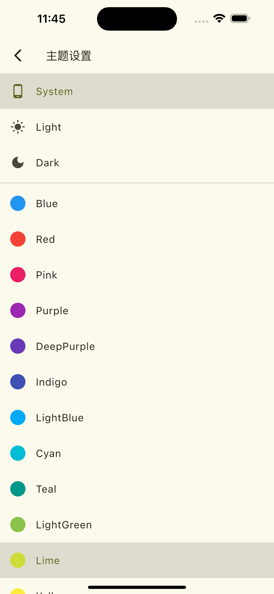

# 玩安卓Flutter版

精美的玩安卓Flutter版本，深度使用Get框架开发，使用基于玩安卓Api搭建的Dart后端服务。

玩安卓Flutter版本，目前支持Web、H5、Android、iOS四个客户端。Web和H5端因为玩安卓的Api不支持跨域和`Flutter Web SDK`
不支持`Set Cookie`，所以只能阉割掉用户相关的功能。Android和iOS端功能正常。

#### [在线体验](https://jackeyvan.github.io/wan_android/)

#### [APK下载](https://xuelongqy.github.io/flutter_easy_refresh/)

#### [Dart后端服务](https://github.com/jackeyvan/wan_android/tree/master/wan_android_backend)

### 功能特点

- 首页Banner，置顶文章，热门文章
- 项目模块，包含各个技术栈的完整项目
- 学习体系，包含各个技术知识技能树
- 导航，常用的各类网站集合
- 公众号模块，热门大V的各类文章
- 用户相关，包括登录，注册，个人积分，个人收藏等
- 设置相关，包括语言，主题选择

### 三方框架

- 状态管理框架深度使用，使用了Get框架大部分功能[Getx](https://pub.dev/packages/get)
- 网络框架封装和使用[Dio](https://pub.dev/packages/dio)
- 页面刷新和加载[EasyRefresh](https://pub.dev/packages/easy_refresh)
- 图片缓存加载框架[CachedNetworkImage](https://pub.dev/packages/cached_network_image)
- Flutter中的Webview框架[FlutterInAppWebView](https://pub.dev/packages/flutter_inappwebview)
- 键值对缓存[GetStorage](https://pub.dev/packages/get_storage)
- Flutter版本吐司[Toast](https://pub.dev/packages/fluttertoast)

### 数据来源

- [玩安卓](https://www.wanandroid.com/api)
- [wan_android_backend](https://github.com/jackeyvan/wan_android/tree/master/wan_android_backend)

### 页面展示

#### 视频

<video src="./screenshot/screen_record.mp4"  poster="./screenshot/home_light.png" controls="controls"></video>

#### 图片

|  |  |  |
|---------------------------------|-----------------------------------|---------------------------------|
|   |      |      |
|    |       |        |

